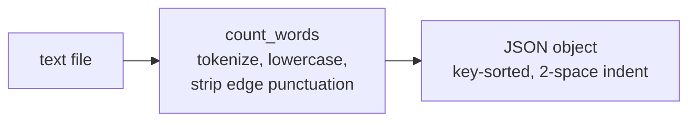

# word-count-utility - as-is

## Purpose

Owns word-counting behavior: tokenization, normalization, and counting (`counter.count_words`), and the `wordstats count` CLI surface that prints frequencies as JSON.

## Design

`count_words` lowercases whitespace-separated tokens and strips punctuation from token edges only, so tokens with internal hyphens (for example `well-known`) remain single words, and punctuation-only tokens are ignored. The CLI requires the `count` subcommand with a UTF-8 file path and prints a 2-space-indented JSON object with alphabetically sorted keys; it is invoked as `PYTHONPATH=src python3 -m wordstats.cli count <file>` because there is no `__main__.py`, so `python -m wordstats` is not a supported entry point.

**Lineage**: [as-is](../../as-is.md#design) / **word-count-utility**

### Count pipeline

## Relationships

- Documented, validated, and smoke-checked by the parent `as-is` root; no sibling components exist.
- Unit behavior is pinned by `tests/test_counter.py`; end-to-end CLI output is pinned by the `checks/validate.sh` smoke check.