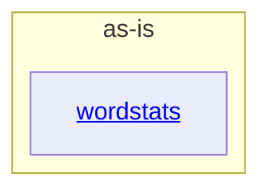

# as-is - as-is

## Purpose

Own the wordstats benchmark seed project as a coherent whole and map its immediate documented components for human readers and agents. This record is durable architecture context, not a task, backlog, configuration, or runtime authority.

## Components

| Component | Purpose |
| --- | --- |
| [`wordstats`](src/wordstats/as-is.md#design) | Word-count library and `count` CLI reporting sorted JSON. |

## Design

The project is a tiny mock Python word-count utility: a `wordstats` library and CLI under `src/wordstats/`, focused unit tests under `tests/`, deterministic validation in `checks/validate.sh`, fixed smoke-check input in `sample-data/words.txt`, and project records under `records/` and `docs/`.

**Lineage**: **as-is**

### Component map

Component boundaries follow the mock ownership records in `records/ownership-map.md`; only `src/wordstats/` carries an owner record with a public contract, so it is the sole documented component. Deterministic validation (compile, unit tests, CLI smoke check against `checks/expected-count.json`) lives in `checks/validate.sh` and is the acceptance gate for any project change.

## Links

- [`README.md`](README.md) — reader-facing project overview and usage.
- [`records/ownership-map.md`](records/ownership-map.md) — ownership and change-scope resolution for requested changes.
- [`docs/design-notes.md`](docs/design-notes.md) — where user-visible behavior decisions are recorded before bounded changes.