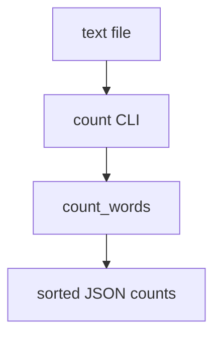

# wordstats - as-is

## Purpose

Provide the word-count library (`counter.py`) and the `count` CLI that report lowercased word frequencies for a UTF-8 text file.

## Design

`count_words` splits on whitespace, lowercases tokens, strips punctuation from token edges only (so internal hyphens such as `well-known` are preserved), ignores punctuation-only tokens, and returns a mapping. The CLI wraps it with argparse as `wordstats count <path>` and prints JSON with alphabetically sorted keys and 2-space indent; the sorted-key contract is fixed by `checks/expected-count.json` and recorded in `docs/design-notes.md`.

**Lineage**: [as-is](../../as-is.md#design) / **wordstats**

### Count pipeline

## Relationships

- Validation: `checks/validate.sh` compiles the package, runs the focused unit tests, and smoke-checks the CLI output against `checks/expected-count.json`; any behavior change must keep this gate green.
- Ownership: the public contract and change scope are declared by the owner record linked below; the parent map is `../../as-is.md`.

## Links

- [`records/owners/core-utility.md`](../../records/owners/core-utility.md) — owner record declaring this component's public contract and change scope.