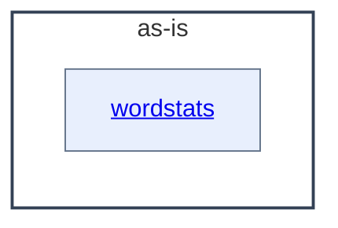

# as-is - as-is

## Purpose

Own the wordstats project's composition model: map its documented components, ownership records, design notes, and deterministic validation so human readers and agents can orient, resolve change scope from the ownership map, and work within bounded component boundaries. This record does not replace the ownership records or design notes it maps.

## Components

Only areas with their own `as-is.md` are components in this record; other directories remain navigable through their own files but are not components.

| Component | Purpose |
| --- | --- |
| [`wordstats`](src/wordstats/as-is.md#design) | Word-count library and `count` CLI owning the project's public counting contract. |

## Design

The project is a tiny word-count utility with deterministic validation; `records/ownership-map.md` governs which areas bounded changes may touch, and `docs/design-notes.md` records the design decisions behind user-visible behavior.

**Lineage**: **as-is**

### Structural container

- `checks/validate.sh` is the deterministic validation entry point (compile check, unit tests, CLI smoke check against `checks/expected-count.json`); it is project validation context, not a component.
- `records/ownership-map.md` resolves change scope; areas without an owner row are changed only after direction from the owning human.
- `docs/design-notes.md` records design decisions (request summary, decision, options considered, bounded change authorized) before bounded changes that alter user-visible behavior.

## Relationships

- `wordstats` is the only documented component; the root record is its sole parent context and every change inside `src/wordstats/` resolves through the `wordstats` record and the core-utility owner record.

## Links

- [`records/ownership-map.md`](records/ownership-map.md) — resolves which areas and change scopes the records authorize.
- [`records/owners/core-utility.md`](records/owners/core-utility.md) — owner record stating the public counting and CLI contract.
- [`docs/design-notes.md`](docs/design-notes.md) — recorded design decisions and the bounded changes they authorize.