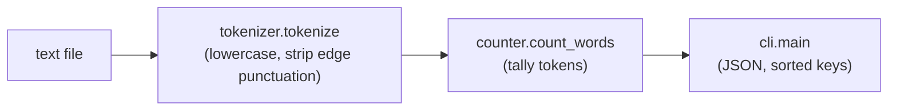

# wordstats - as-is

## Purpose

Provide the project's word-count capability: count words in text with the public contract — lowercase tokens, punctuation stripped from token edges, punctuation-only tokens ignored, counts returned as a mapping — and expose it through a `wordstats count <path>` CLI that prints JSON with sorted keys.

## Design

The library keeps counting orchestration in `counter.count_words`; tokenization (lowercasing and edge-punctuation stripping) is a separate responsibility in `tokenizer.tokenize`, and `cli.py` adapts the counting result to the JSON output contract.

**Lineage**: [as-is](../../as-is.md#design) / **wordstats**

### Count command flow

- `tokenizer.py` owns normalization of raw text into clean tokens; it has no counting knowledge.
- `counter.py` owns the counts mapping contract and delegates token production to `tokenizer.py`.
- `cli.py` owns file reading and the JSON output shape; it adds no counting behavior.
- `tests/test_counter.py` and `checks/validate.sh` pin the public contract; behavior changes require the checks to pass unchanged unless the design notes authorize a contract change.

## Links

- [`../../records/owners/core-utility.md`](../../records/owners/core-utility.md) — owner record stating this component's public contract and change scope.