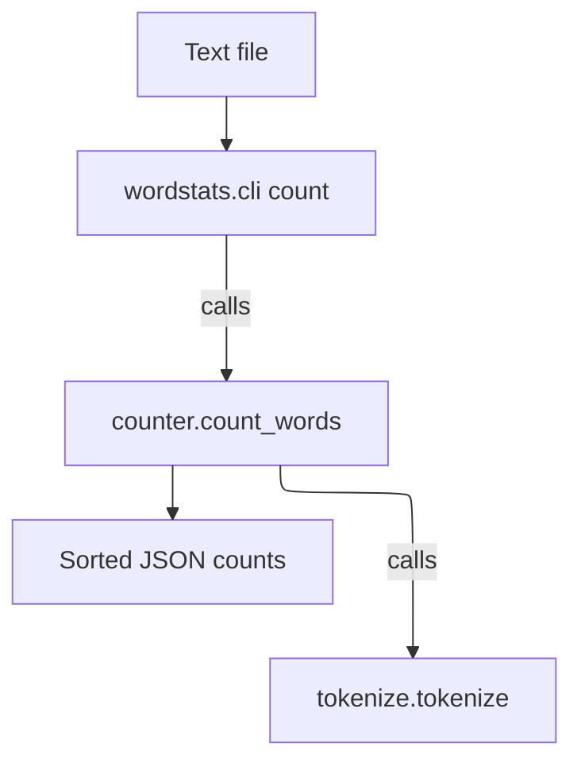

# as-is - as-is

## Purpose

Provide the durable architecture record for the wordstats project: a tiny word-count library and `count` CLI validated by deterministic checks. It orients readers to the project's responsibility, composition, and validation path; the ownership records under `records/` remain the change-authority map.

## Design

The project is a single small component: the wordstats library and CLI share one ownership record and one public contract (lowercase tokens, punctuation stripped from token edges, punctuation-only tokens ignored, counts as JSON with sorted keys). Tokenization is isolated in its own module and consumed by the counter; the CLI wraps the counter for file input.

**Lineage**: **as-is**

### Word-count pipeline

## Relationships

- `records/owners/core-utility.md` owns the word-count logic and CLI surface (`src/wordstats/`); `records/owners/design-notes.md` owns `docs/design-notes.md` and `README.md`; `records/ownership-map.md` is the ownership map.
- `checks/validate.sh` is the deterministic validation gate (compile, unit tests, CLI smoke check) and is run before status reporting.
- Areas absent from the ownership map have no owner record; a change that cannot resolve an owner or scope stops for direction rather than guessing.
