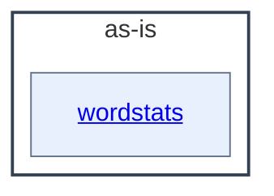

# as-is - as-is

## Purpose

Own the repository-wide composition model for the wordstats benchmark seed and
provide the top-level map of its documented components. This record is durable
shared context for human readers and agents; it does not replace the records
owned by the areas it maps.

## Components

| Component | Purpose |
| --- | --- |
| [`wordstats`](src/wordstats/as-is.md#design) | Provide the word-count library and `count` CLI surface. |

## Design

This is a component map, not an execution sequence. The root record connects
the project to its one documented component area; `records/ownership-map.md`
remains the seed's mock ownership record and `checks/validate.sh` the
deterministic validation entry point.

**Lineage**: **as-is**

### Project component map

Only `src/wordstats` has its own `as-is.md` and is a component here. `tests/`,
`checks/`, `sample-data/`, `docs/`, and `records/` remain ordinary project
areas navigable through their own files, governed by the seed's mock owner
records.