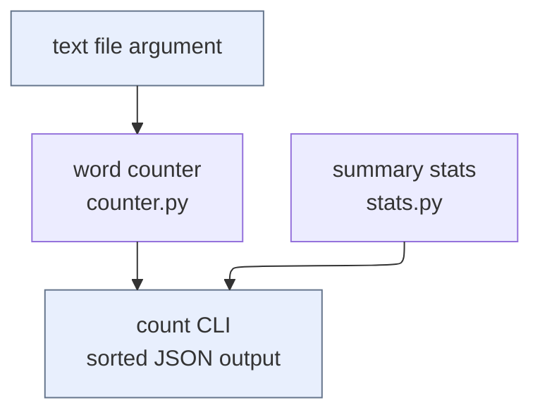

# wordstats - as-is

## Purpose

Provide the word-count library and `wordstats count` CLI surface: lowercase
tokens with punctuation stripped from token edges, punctuation-only tokens
ignored, counts returned as a mapping, CLI output as sorted JSON.

## Design

One small Python package whose CLI is the stable reader-facing surface. The
public contract is fixed by `records/owners/core-utility.md`; deterministic
validation lives in `checks/validate.sh`.

**Lineage**: [as-is](../../as-is.md#design) / **wordstats**

### Count pipeline

With `count --stats` the CLI appends the summary object (`min`, `max`,
`median`, `unique`) after the counts mapping as a JSON array; default output
without the flag is unchanged.

## Relationships

| Relationship | Direction | Fact |
| --- | --- | --- |
| checks harness | validates | `checks/validate.sh` compiles the package, runs its unit tests, and smoke-checks the `count` CLI against `checks/expected-count.json`. |
| owner record | authorizes | `records/owners/core-utility.md` owns this component's change scope. |

## Links

- Owner record → `../../records/owners/core-utility.md` — the authoritative scope and public-contract statement for changes to this component.