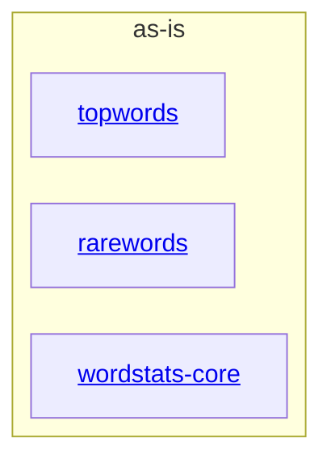

# as-is - as-is

## Purpose

The wordstats benchmark seed project: a tiny word-count library and CLI (`wordstats count`) with deterministic validation. This record is the canonical architecture map for the project.

## Components

| Component | Purpose |
| --- | --- |
| [`wordstats-core`](src/wordstats/as-is.md#design) | Word-count library and `count` CLI surface. |
| [`rarewords`](records/components/rarewords/as-is.md#design) | `--rare N` filtering logic: keep words with N or fewer occurrences. |
| [`topwords`](records/components/topwords/as-is.md#design) | `--top N` filtering logic: keep the N most frequent words, ties alphabetical. |

## Design

The project root composes one Python package (`src/wordstats/`) with its tests (`tests/`), deterministic checks (`checks/validate.sh`), and mock ownership records (`records/`). The `count` CLI computes a counts mapping via `counter.count_words`, then may pass it through the `rarewords` and/or `topwords` filter modules (applied in that order) before printing sorted JSON. Invalid `N` values exit with status 2.

**Lineage**: **as-is**

### Structural container

## Relationships

- `rarewords` and `topwords` are independent sibling filters; each consumes only the counts mapping produced by `wordstats-core` and is selected by a distinct CLI option.
- `records/owners/` holds the mock owner records; `docs/design-notes.md` records human-facing design decisions newest last.

## Links

- `checks/validate.sh` → deterministic validation (compile, unit tests, CLI smoke check).
- `records/ownership-map.md` → area-to-owner resolution for change scope.
- `docs/design-notes.md` → design decisions recorded before behavior-changing bounded work.