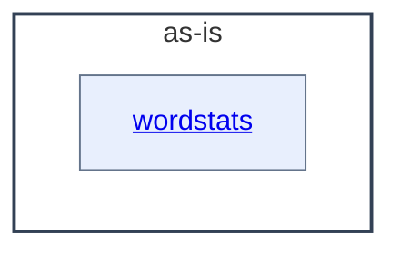

# as-is - as-is

## Purpose

Map the wordstats benchmark fixture project: its word-count library, its `wordstats count` CLI surface, and the bounded feature components that extend the CLI. This record is durable shared context for human readers and agents; it does not replace the records owned by the areas it maps.

## Components

| Component | Purpose |
| --- | --- |
| [wordstats](src/wordstats/as-is.md#design) | Word-count library and `wordstats count` CLI. |

## Design

This is a component map, not a mandatory execution sequence. The root record connects the project component to its documented child areas; deeper descendants are linked by their immediate parent rather than by this record.

**Lineage**: **as-is**

### Project component container

## Relationships

- `records/ownership-map.md` and `records/owners/` hold the mock ownership records that support component and scope resolution for bounded changes.
- `checks/validate.sh` is the deterministic validation surface for every bounded change in this project.