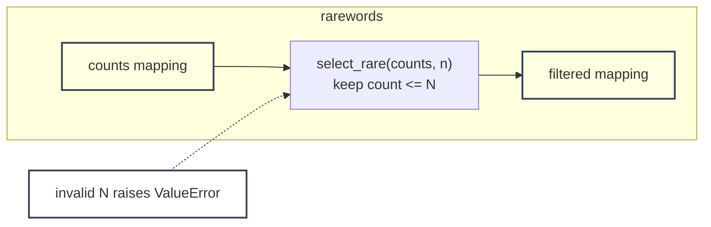

# rarewords - as-is

## Purpose

Own the `--rare N` frequency filter for `wordstats count`: keep only words whose occurrence count is N or fewer, with N validated as a positive integer.

## Design

The component is a single pure-Python module, `src/wordstats/rarewords.py`, exposing a pure selection function over an existing counts mapping. It never counts words itself and never prints; the `wordstats count` CLI composes it after counting. Invalid N raises a clear error that the CLI translates into exit code 2.

**Lineage**: [as-is](../../../as-is.md) → [wordstats](../../../src/wordstats/as-is.md) → **rarewords**

### Filter boundary view

## Relationships

- Parent: [wordstats](../../../src/wordstats/as-is.md), which owns the CLI wiring for `--rare`.
- Sibling: [topwords](../topwords/as-is.md#design); the two are independent and composed sequentially by the CLI when both options are given.
- The module file lives beside the parent's sources at `src/wordstats/rarewords.py`; this record directory owns the component's task record and history only.

## Links

- `../../../src/wordstats/rarewords.py` — the component's entire artifact; its exact behavior is the component boundary.