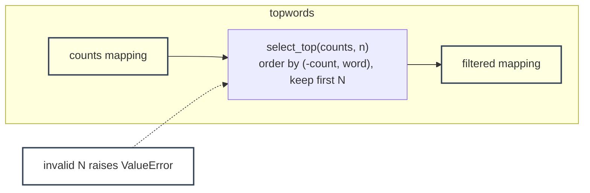

# topwords - as-is

## Purpose

Own the `--top N` frequency filter for `wordstats count`: keep only the N most frequent words, ties broken alphabetically, with N validated as a positive integer.

## Design

The component is a single pure-Python module, `src/wordstats/topwords.py`, exposing a pure selection function over an existing counts mapping. It orders words by descending count then ascending word and keeps the first N. Invalid N raises a clear error that the CLI translates into exit code 2.

**Lineage**: [as-is](../../../as-is.md) → [wordstats](../../../src/wordstats/as-is.md) → **topwords**

### Selection boundary view

## Relationships

- Parent: [wordstats](../../../src/wordstats/as-is.md), which owns the CLI wiring for `--top`.
- Sibling: [rarewords](../rarewords/as-is.md#design); the two are independent and composed sequentially by the CLI when both options are given.
- The module file lives beside the parent's sources at `src/wordstats/topwords.py`; this record directory owns the component's task record and history only.

## Links

- `../../../src/wordstats/topwords.py` — the component's whole artifact; its exact behavior is the component boundary.