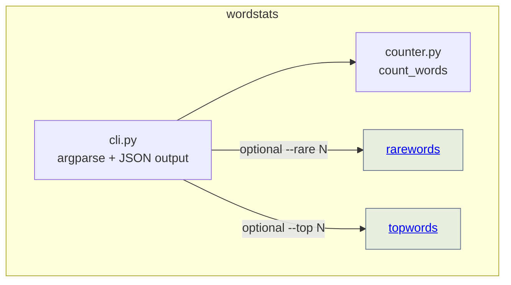

# wordstats - as-is

## Purpose

Own the word-count library and the `wordstats count` CLI: lowercase tokens, punctuation stripped from token edges, punctuation-only tokens ignored, counts returned as a mapping, and CLI output as JSON with sorted keys.

## Components

| Component | Purpose |
| --- | --- |
| [rarewords](../../records/components/rarewords/as-is.md#design) | `--rare N` filter module keeping words with N or fewer occurrences. |
| [topwords](../../records/components/topwords/as-is.md#design) | `--top N` filter module keeping the N most frequent words with alphabetical tie-breaking. |

## Design

The component is a small pure-Python library plus an argparse CLI. `counter.py` holds the tokenization and counting contract; `cli.py` owns argument parsing, filter wiring, and JSON output with sorted keys. Feature filter modules are separate bounded components that the CLI composes after counting.

**Lineage**: [as-is](../../as-is.md) → **wordstats**

### CLI composition view

## Relationships

- Parent: [as-is](../../as-is.md) project root record.
- Owner record: `records/owners/core-utility.md` (component change scope for `src/wordstats/`).
- Validation: `checks/validate.sh` (compile, unit tests, CLI smoke check) is the acceptance automation for changes here.

## Links

- `../../docs/design-notes.md` — user-visible CLI behavior changes are recorded there before bounded work, and the notes bound what each change authorizes.