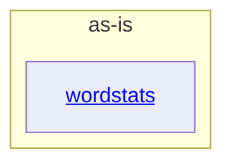

# as-is - as-is

## Purpose

The benchmark wordstats project provides a small, deterministic word-count library and JSON command-line interface used to exercise bounded workflow changes.

## Components

| Component | Purpose |
| --- | --- |
| [`wordstats`](src/wordstats/as-is.md#design) | Owns word tokenization, counting, and the `count` CLI surface. |

## Design

The project root contains the wordstats component and project-level tests, checks, sample data, and design records.

**Lineage**: **as-is**

### Project component boundary

The root coordinates project-level documentation, validation, and the single application component without exposing private implementation details as separate components. The component's public count command may additionally emit a summary object when explicitly requested.

## Relationships

The `wordstats` component uses the project-level design-note convention for user-visible behavior and is validated by the root test and check artifacts.

## Links

- Ownership and scope context → `records/ownership-map.md` — resolves the existing owner boundary for the wordstats component.
- User-visible design decisions → `docs/design-notes.md` — records the project's bounded behavior decisions.
