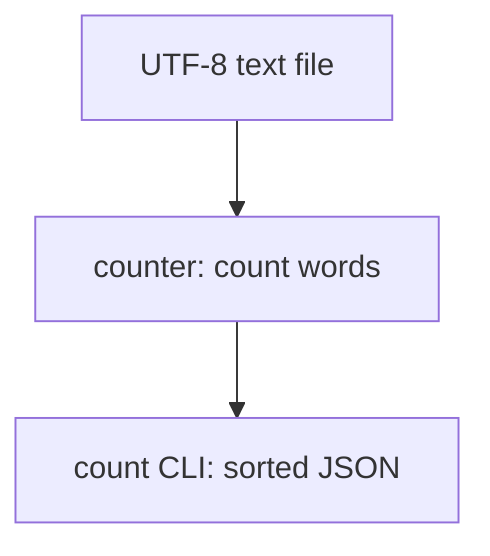

# wordstats - as-is

## Purpose

The wordstats component owns lowercased word counting and the `wordstats count` command's sorted JSON output.

## Design

The component turns UTF-8 text into a word-count mapping through the counter library and exposes that result through the CLI.

**Lineage**: [as-is](../../as-is.md#design) / **wordstats**

### Counting request flow

The counter lowercases tokens, strips punctuation from token edges, ignores punctuation-only tokens, and returns a mapping. The CLI owns file input, argument parsing, and JSON presentation.

## Relationships

The component is owned as one library-and-CLI boundary. Project-level tests exercise the counter contract and the root check script exercises the public command.

## Links

- Existing component contract → `../../records/owners/core-utility.md` — states the public tokenization and CLI-output responsibilities that this record contextualizes.
