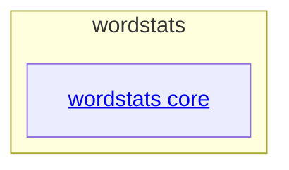

# wordstats - as-is

## Purpose

Map the wordstats benchmark project: a small word-count library and `count` CLI with deterministic validation. This record is durable architecture context and does not replace the owner records under `records/owners/`.

## Components

| Component | Purpose |
| --- | --- |
| [wordstats core](src/wordstats/as-is.md#design) | Own the word-count logic and CLI surface under `src/wordstats/`. |

## Design

The project is a single small utility: `src/wordstats/` implements counting and the CLI, `tests/` holds unit tests, and `checks/validate.sh` is the deterministic check entry point. Human-facing user-visible decisions are recorded in `docs/design-notes.md`; ownership is resolved through `records/ownership-map.md`.

**Lineage**: **wordstats**

### Project structure

Support areas (`tests/`, `checks/`, `docs/`, `records/`, and `sample-data/`) serve the core component and are not separately documented components.
