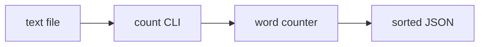

# wordstats core - as-is

## Purpose

Own the word-count library and `wordstats count` CLI under `src/wordstats/`, including tokenization, counting, and user-visible JSON output.

## Design

The public contract is lowercase tokens, punctuation stripped from token edges, punctuation-only tokens ignored, counts returned as a mapping, and CLI JSON output with sorted keys. `counter.py` holds `count_words`; `stats.py` holds `summarize_counts`; `cli.py` is the argparse entry point for `wordstats count <path>` and optionally appends a `stats` summary object.

**Lineage**: [wordstats](../../as-is.md#design) / **wordstats core**

### Count flow

## Relationships

- `checks/validate.sh` validates this component through compilation, unit tests, and a CLI smoke check.
- `tests/` exercises the word-count contract.
- `docs/design-notes.md` records user-visible output decisions before bounded changes.
- `records/owners/stats.md` owns the summary helper's contract; the helper is read by the CLI only when `--stats` is selected.
