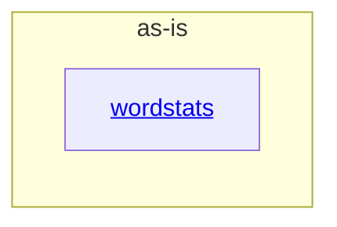

# as-is - as-is

## Purpose

Provide the canonical architecture map for the wordstats project while keeping active task authority in JSON task companions and transient task narratives.

## Components

| Component | Purpose |
| --- | --- |
| [wordstats](src/wordstats/as-is.md#design) | Count words and expose the `wordstats count` command. |

## Design

The project root documents the wordstats capability and routes readers to its implementation component.

**Lineage**: **as-is**

### Project capability map

## Relationships

- The wordstats component provides the user-visible counting capability and owns its implementation boundary.
