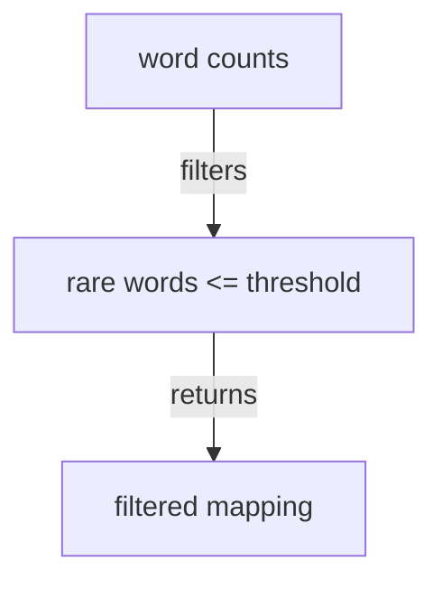

# rarewords - as-is

## Purpose

Provide the pure rare-word filter that keeps only entries whose occurrence count is at or below a caller-supplied threshold.

## Design

The component accepts a word-to-count mapping and a positive threshold, returning a new mapping without I/O or CLI parsing.

**Lineage**: [as-is](../../../as-is.md#design) / [wordstats](../../../src/wordstats/as-is.md#design) / **rarewords**

### Rare-word filtering

The CLI validates the threshold and owns user-facing diagnostics; this component owns only the deterministic mapping transformation.

## Relationships

- `rarewords` is used by the `wordstats` CLI after counting and before JSON serialization.
- The implementation is located at `src/wordstats/rarewords.py` because the package uses file modules; this record directory is the bounded task and architecture record location for that file component.
