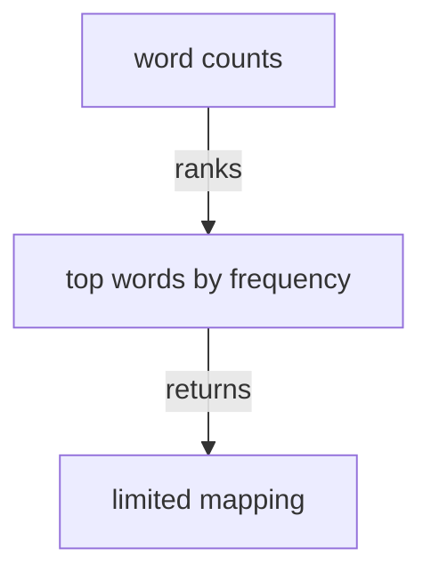

# topwords - as-is

## Purpose

Provide the pure top-word selector that keeps the requested number of highest-frequency entries and resolves equal counts alphabetically.

## Design

The component accepts a word-to-count mapping and a positive limit, returning a new mapping ordered for deterministic selection; it performs no I/O or CLI parsing.

**Lineage**: [as-is](../../../as-is.md#design) / [wordstats](../../../src/wordstats/as-is.md#design) / **topwords**

### Top-word selection

Frequency ranks descend and alphabetical order resolves ties; the CLI owns positive-integer validation and JSON presentation.

## Relationships

- `topwords` is used by the `wordstats` CLI after counting and before JSON serialization.
- The implementation is located at `src/wordstats/topwords.py` because the package uses file modules; this record directory is the bounded task and architecture record location for that file component.
