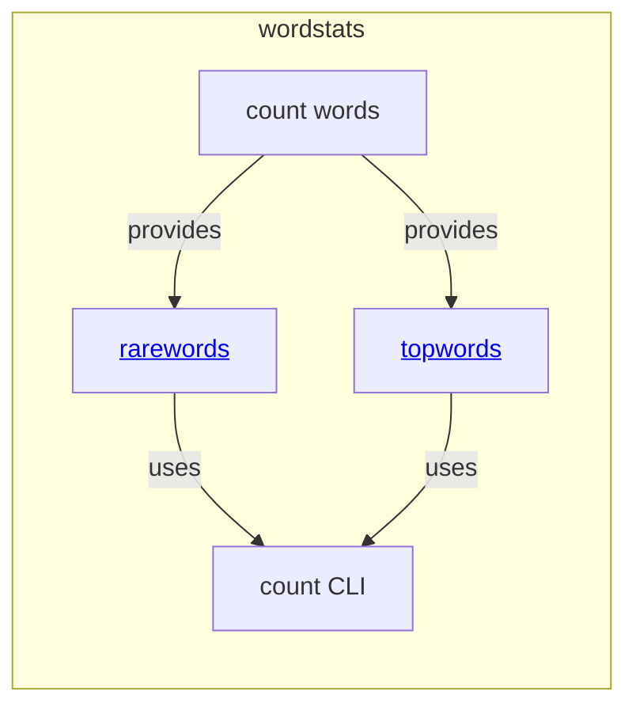

# wordstats - as-is

## Purpose

Own the word-count library and the `wordstats count` CLI, including bounded post-count filters exposed as command options.

## Components

| Component | Purpose |
| --- | --- |
| [rarewords](../../records/components/rarewords/as-is.md#design) | Filter counted words to occurrences at or below a positive threshold. |
| [topwords](../../records/components/topwords/as-is.md#design) | Select the most frequent counted words with alphabetical tie-breaking. |

## Design

The component counts normalized words, applies any requested bounded filters, and emits deterministic JSON with alphabetically sorted keys.

**Lineage**: [as-is](../../as-is.md#design) / **wordstats**

### Wordstats filter boundary

The filters are pure mapping transformations; the CLI owns argument parsing, validation, composition, file I/O, error reporting, and JSON presentation.

## Relationships

- `wordstats` uses the existing counter and delegates bounded filtering to the rarewords and topwords components.
- The component remains within the core-utility owner boundary recorded in `records/ownership-map.md`.
