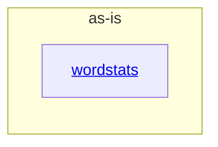

# as-is - as-is

## Purpose

The project provides a small word-frequency library and the `wordstats count` command, preserving deterministic JSON output for text-file word counts and bounded frequency filtering.

## Components

| Component | Purpose |
| --- | --- |
| [`wordstats`](records/components/wordstats/as-is.md#design) | Owns word counting, count-command behavior, and the independently documented frequency-filtering capabilities. |

## Design

The project exposes one focused word-statistics component whose library and CLI share the count mapping contract.

**Lineage**: **as-is**

### Project component map

The root record is an orientation map. Component behavior and child relationships are documented by the linked `wordstats` record.

## Relationships

- The project documentation records user-visible design decisions before behavior changes.
- The wordstats component uses the project-owned count contract and deterministic checks.
