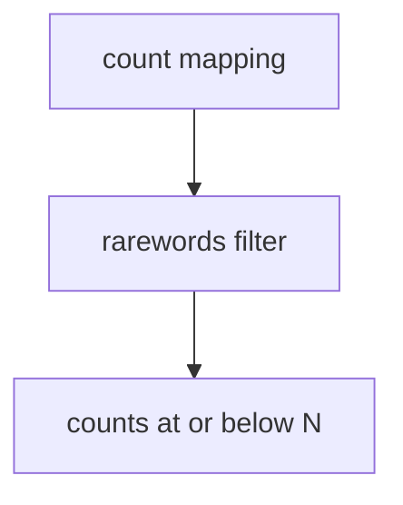

# rarewords - as-is

## Purpose

The `rarewords` component provides the pure frequency filter that retains words occurring no more than a caller-supplied positive threshold.

## Design

The helper accepts a word-to-count mapping and returns the entries whose counts are less than or equal to the requested maximum, without owning parsing, file I/O, or JSON formatting.

**Lineage**: [as-is](../../../as-is.md#design) / [wordstats](../wordstats/as-is.md#design) / **rarewords**

### Rare-frequency filtering

The CLI owns positive-integer validation and supplies the threshold. The filter preserves the mapping values and excludes only entries above the threshold.

## Relationships

- `wordstats` uses this component after counting when `--rare N` is requested.
- The component's implementation artifact is `src/wordstats/rarewords.py`; the centralized record location preserves the project's existing `records/` convention.
