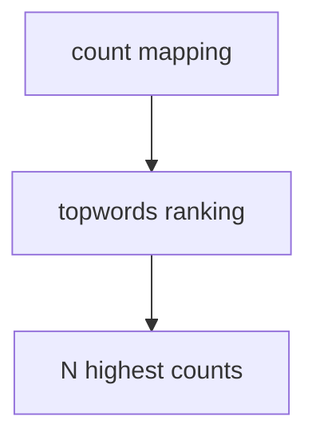

# topwords - as-is

## Purpose

The `topwords` component provides the pure frequency ranking filter that retains the N most frequent words with alphabetical tie-breaking.

## Design

The helper accepts a word-to-count mapping and a positive limit, orders entries by descending frequency then ascending word, and returns at most the requested number of entries without owning parsing, file I/O, or JSON formatting.

**Lineage**: [as-is](../../../as-is.md#design) / [wordstats](../wordstats/as-is.md#design) / **topwords**

### Top-frequency selection

The CLI owns positive-integer validation and supplies the limit. Alphabetical ordering is used only to resolve equal counts; the established CLI JSON serializer remains responsible for sorted output keys.

## Relationships

- `wordstats` uses this component after counting when `--top N` is requested.
- The component's implementation artifact is `src/wordstats/topwords.py`; the centralized record location preserves the project's existing `records/` convention.
