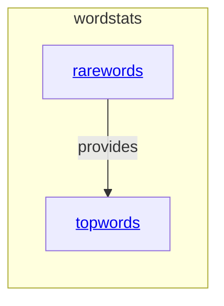

# wordstats - as-is

## Purpose

The `wordstats` component owns lowercase word counting, the `count` CLI surface, and the composition of independent frequency filters into deterministic JSON output.

## Components

| Component | Purpose |
| --- | --- |
| [`rarewords`](../rarewords/as-is.md#design) | Keeps only words whose occurrence count is at or below a positive threshold. |
| [`topwords`](../topwords/as-is.md#design) | Keeps only the requested number of most frequent words, breaking ties alphabetically. |

## Design

The component transforms text into a count mapping and optionally applies one or both bounded frequency filters before serializing sorted-key JSON.

**Lineage**: [as-is](../../../as-is.md#design) / **wordstats**

### Frequency filtering components

The `counter` library establishes the count mapping. The CLI validates positive integer option values, applies `rarewords` first and then `topwords` when both are requested, and emits the established sorted JSON format. `rarewords` and `topwords` are independent children; their helper modules do not own CLI parsing or output formatting.

## Relationships

- `counter` provides the initial mapping consumed by the CLI and filters.
- The CLI uses either filter independently and may apply both in command-line order defined by the integration.
- The component is owned according to [`records/owners/core-utility.md`](../../owners/core-utility.md).
- User-visible output decisions are recorded in [`docs/design-notes.md`](../../../docs/design-notes.md).
