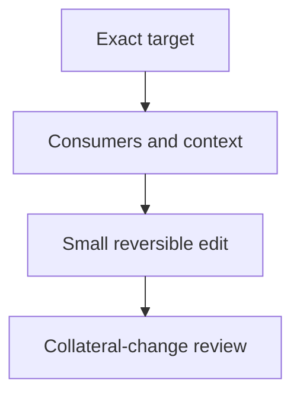

### Purpose

Make surgical changes to existing artifacts.

### Approach

Inspect consumers and surrounding conventions, make the smallest reversible replacement, and preserve unrelated content and authority.

### How it should be done

Confirm the exact target and literal transformation; inspect consumers and nearby context; use a precise replacement; review the diff for collateral changes; run focused checks; stop if the target, owner, or transformation is ambiguous. The stop is terminal: if the target, owner, or transformation is ambiguous, stop for direction before any edit.

This skill makes surgical changes to existing artifacts and does not cover new or substantially generated implementation; `writing-code` is a separate capability.

#### Design view

