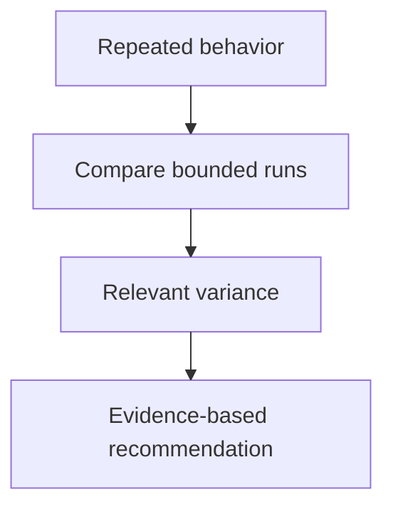

## Purpose

Identify evidence-supported deterministic improvements.

## Approach

Compare repeated behavior and inputs, isolate nondeterministic sources, and recommend only changes supported by observed variance.

## How it should be done

Classify steps as policy, transformation, observation, or judgment; compare bounded repetitions; quantify relevant variance and benefit; preserve intentional generative behavior; recommend retention, a bounded backlog item, or an explicitly authorized task.

## Design view

