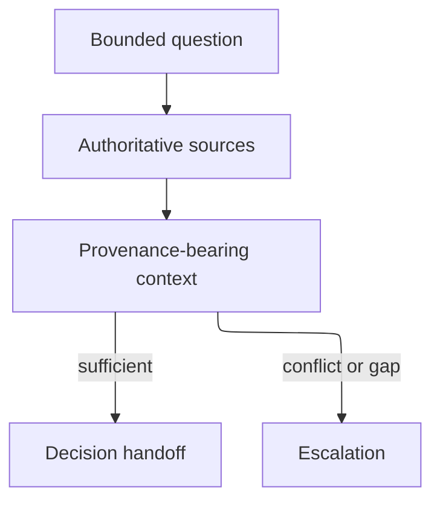

## Purpose

Assemble the smallest authoritative context for a bounded decision or handoff.

## Approach

Identify the decision, gather authoritative records and direct evidence, and stop when the context is sufficient without widening scope.

## How it should be done

State the question and stopping condition; read the owning record, applicable contract, acceptance conditions, and named dependencies; label facts, assumptions, and unknowns; preserve source links; escalate conflicts instead of filling gaps from proximity.

## Design view

