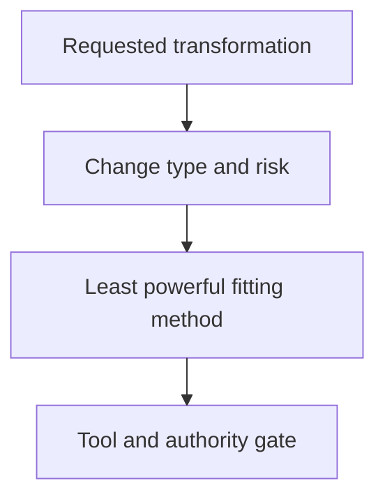

## Purpose

Select appropriate change capabilities for bounded scopes and risks.

## Approach

Choose code generation, bounded editing, content work, delegation, or another capability from the requirement, scope, and risk rather than habit.

## How it should be done

Classify the requested transformation as new implementation, surgical edit, content drafting, test work, delegation, or maintenance; verify required tools and permissions; choose the least powerful fitting method; stop when no method is authorized.

- "Stop when no method is authorized" is a terminal stop-for-direction step, not an advisory note or fallback.
- "Choose the least powerful fitting method" is the selection criterion, not a preference.
- This skill does not grant tools. Verify that the agent has every tool needed for its selected path; if a required tool or permission is missing, the workflow stops with a bounded missing-capability blocker, and it must not silently substitute a weaker tool. This rule governs the tools of the selected path; the terminal stop above governs the case where no method is authorized.
- A master composition may select between `writing-code` and `applying-bounded-edits` after this skill classifies the change; this skill implements, references, and depends on no other skill.

#### Design view

