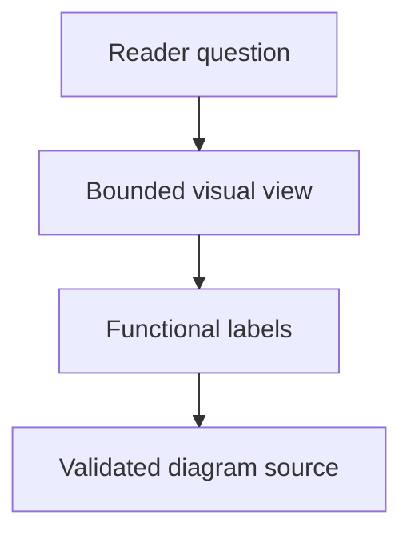

## Purpose

Design bounded reader-oriented visual explanations.

## Approach

Select a diagram type and symbols that explain the intended relationships while keeping source, navigation, and ownership accurate.

## How it should be done

Define the reader question and view boundary; choose functional nodes and canonical relationships; include only supported context; design labels and layout for scanning; provide source and expected navigation targets for validation.

## Design view

