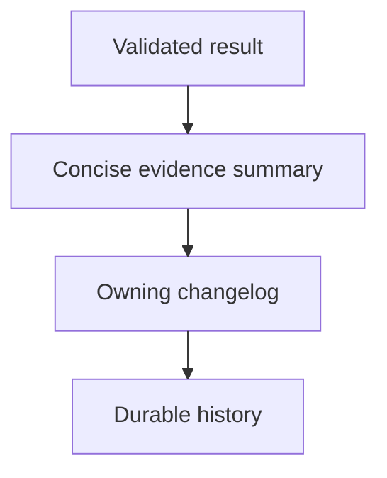

## Purpose

Prepare concise history entries for the owning changelog procedure.

## Approach

Summarize the durable result, evidence, scope, and residual risk without replacing the owning changelog or completion protocol.

## How it should be done

Wait for validated completion evidence; name the task or change identity; summarize result and checks; state residual risk and source commits where applicable; let the owning procedure decide placement and cleanup.

## Design view

