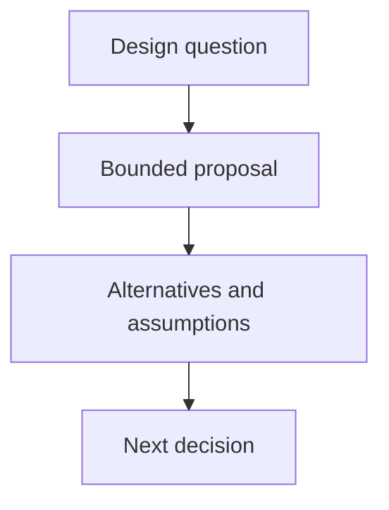

## Purpose

Produce a bounded proposal without claiming adoption or completion.

## Approach

State purpose, alternatives, assumptions, boundaries, and next decision while keeping proposal content separate from current authority.

## How it should be done

Write the proposed outcome, rationale, scope, alternatives, dependencies, risks, acceptance, and next decision; label it as draft; avoid operational instructions that pretend adoption; route approval to the authority-bearing owner.

## Design view

