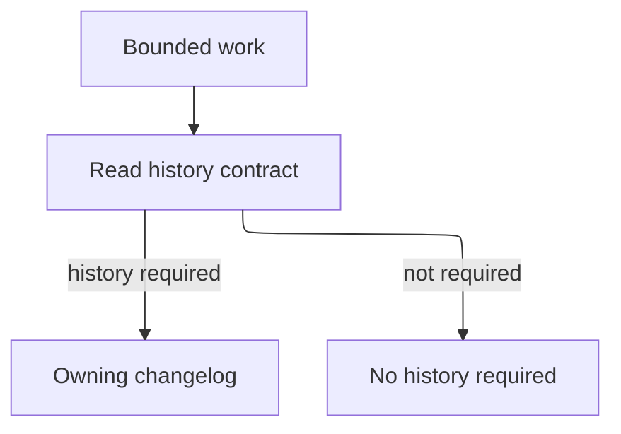

## Purpose

Resolve the changelogs owned by the target scopes.

## Approach

Use explicit ownership records and applicable history contracts before considering repository conventions; never select by proximity alone.

## How it should be done

Read the task, component, project, or root history contract; resolve configured filenames and owning records; determine whether history is required; return the exact path and rationale, or explicitly record that no history is required.

## Design view

