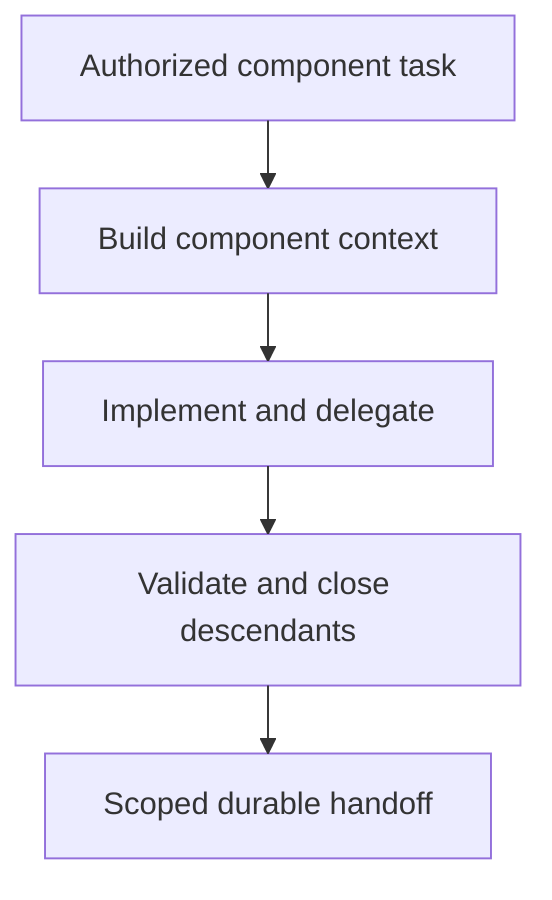

## Purpose

**Purpose**: Build bounded component tasks with delegation, validation, history, and completion handoffs.

## Approach

**Approach**: Build context, authorize the component task, delegate bounded work where useful, enforce acceptance and descendant gates, and prepare the owning completion handoff.

## How it should be done

**How it should be done**: Read the component record and authorized task; build decision context; obtain required plan review; stop at child boundaries; delegate only through configured workers; implement, test, validate, close descendants, write history, reconcile backlog, clean task artifacts, and prepare the scoped commit.

## Design view



## Composition context

Workflow example (drafts/composable-skills.md lines 168-170):

```text
building-components = resolving-scopes → building-context → implementing-tasks → writing-code or applying-bounded-edits → writing-tests → validating-changes → managing-changelogs → preparing-scoped-commits
```

Target-design text composition (drafts/agentic-development-system-high-level-design-draft11/target-design.md lines 481-489):

```text
building-components
  = context building
  → parent plan injection or child plan intake
  → child-local implementation
  → child-level verification
  → child integration with parent worktree
  → status handoff
  → parent planning accounting
```

Tool-access composition admission (drafts/composable-skills.md lines 112-113): A skill does not grant tools. Before an agent is admitted to a master skill or composition, the composition's required tool set must be compared with the agent's declared tools, permissions, and authority. The agent must have every tool needed for its selected path, or the workflow must stop with a bounded missing-capability blocker; it must not silently substitute a weaker tool, broaden permissions, or ask a read-only agent to perform mutation.