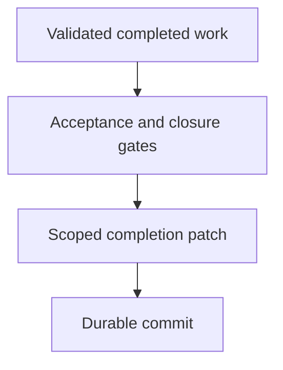

## Purpose

**Purpose**: Verify completion gates and prepare scoped durable handoffs.

## Approach

**Approach**: Confirm acceptance and descendant closure, stage only the changelog, exact backlog cleanup, task cleanup, and declared handoff, then verify and commit once.

## How it should be done

**How it should be done**: Verify completion eligibility and descendant closure; obtain exact cleanup evidence; stage only declared files; inspect cached diff and whitespace; commit with established style; verify the commit and leave unrelated work untouched.

## Design view

## Composition context

Tool-access row (drafts/composable-skills.md line 124):

| Preparing or committing completed work | Bounded Git inspection and the authorized commit procedure | Staging and commit access requires completion gates and scoped ownership; a composition cannot grant commit authority. |

Tool-access composition admission (drafts/composable-skills.md lines 112-113): A skill does not grant tools. Before an agent is admitted to a master skill or composition, the composition's required tool set must be compared with the agent's declared tools, permissions, and authority. The agent must have every tool needed for its selected path, or the workflow must stop with a bounded missing-capability blocker; it must not silently substitute a weaker tool, broaden permissions, or ask a read-only agent to perform mutation.