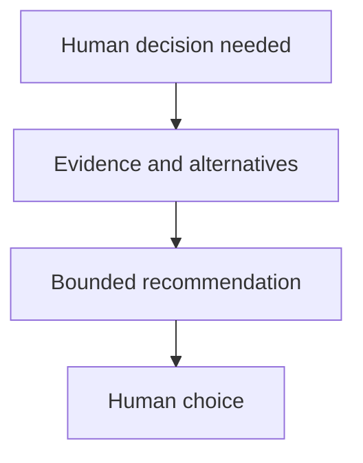

## Purpose

**Purpose**: Guide bounded decisions while preserving human agency.

## Approach

**Approach**: Present the decision, evidence, alternatives, uncertainty, and recommendation, then stop for the authorized human choice.

## How it should be done

**How it should be done**: Clarify only material questions; state the decision and context; present a small set of evidence-backed options and trade-offs; identify uncertainty and professional authority where relevant; recommend without deciding or executing.

## Design view

## Composition context

No composition table, workflow example, or tool-access row is cited for this master by the realization plan (plan section 7 composition-context column: "—"). Carry the general tool-access acknowledgment as composition-admission documentation (drafts/composable-skills.md lines 112-113): A skill does not grant tools. Before an agent is admitted to a master skill or composition, the composition's required tool set must be compared with the agent's declared tools, permissions, and authority. The agent must have every tool needed for its selected path, or the workflow must stop with a bounded missing-capability blocker; it must not silently substitute a weaker tool, broaden permissions, or ask a read-only agent to perform mutation.
