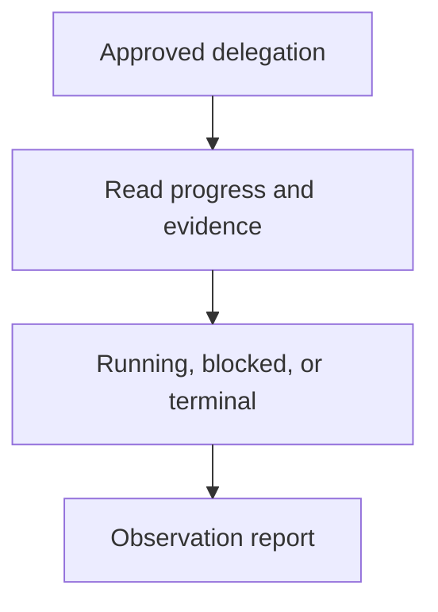

## Purpose

Observe delegated progress, results, budgets, and terminal status.

## Approach

Read approved progress and evidence surfaces incrementally, report blockers and outcomes, and avoid directing work outside granted authority.

## How it should be done

Use the approved handle, task record, logs, traces, or session selectors; read incrementally; compare progress with acceptance and budget; classify running, blocked, failed, or terminal; preserve the worker's scope and do not infer completion.

## Design view

