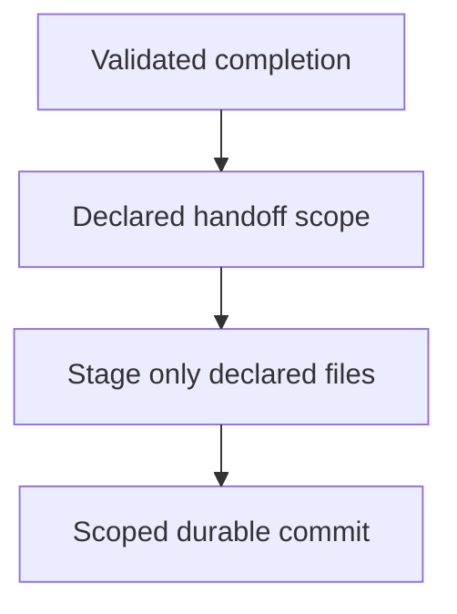

## Purpose

Prepare authorized validated changes without staging unrelated work.

## Approach

Separate the declared handoff, inspect the staged patch, run required checks, and stop when scope or completion authority is missing.

Treat the final clause as a terminal stop-for-direction step: when scope or completion authority is missing, stop and request direction instead of proceeding.

## How it should be done

Confirm acceptance and descendant closure; identify declared artifacts; stage only the changelog, exact backlog cleanup, task cleanup, and handoff; inspect staged diff and `git diff --cached --check`; commit once with repository message style.

## Design view

