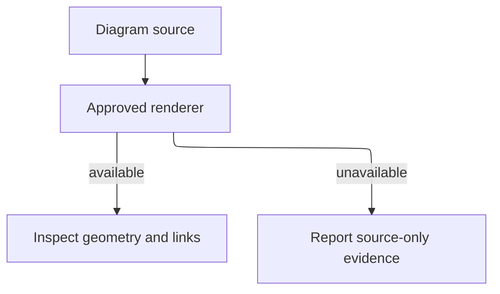

## Purpose

Render and inspect diagrams when rendering is material.

## Approach

Use the available renderer, inspect the output and expected links, and report unsupported renderer capability separately from source validity.

## How it should be done

Validate source syntax first; render through the approved local capability; inspect geometry, labels, links, and expected hrefs; distinguish renderer-unavailable from source-invalid; retain source-level evidence when rendering cannot run.

## Design view

