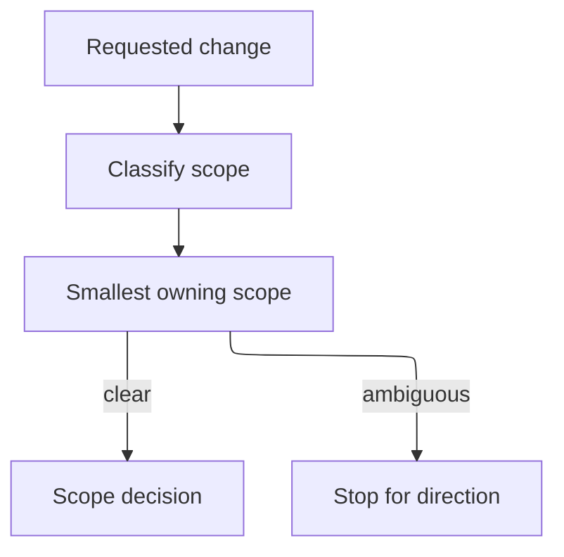

## Purpose

Resolve component, artifact, project, or root scopes without assuming a component task.

## Approach

Classify the requested change, locate the smallest owning scope, and stop for explicit direction when ownership or task applicability is ambiguous.

## How it should be done

Identify the requested outcome and changed artifact; inspect component records and ownership contracts; test component-task applicability; choose component, artifact, project, or root scope; record the decision; stop on competing owners or missing policy.

## Design view

