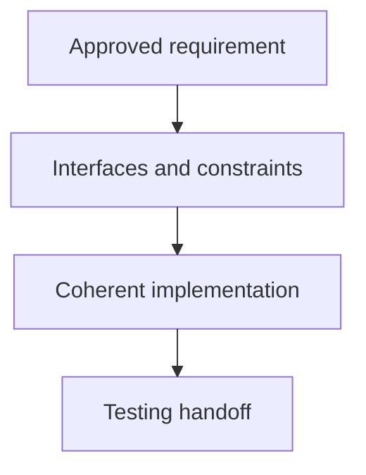

## Purpose

Create or substantially implement code from a bounded requirement.

## Approach

Translate an authorized requirement into new or substantially generated implementation, then hand the result to focused testing and validation.

## How it should be done

Read the requirement, interfaces, constraints, and nearby patterns; define changed artifacts and acceptance mapping; implement the smallest coherent path; preserve ownership and error behavior; return the diff for testing and validation rather than claiming completion.

This skill supports new or substantially generated implementation from a bounded requirement and does not cover surgical changes to existing artifacts, which applying-bounded-edits covers as a separate capability.

## Design view

