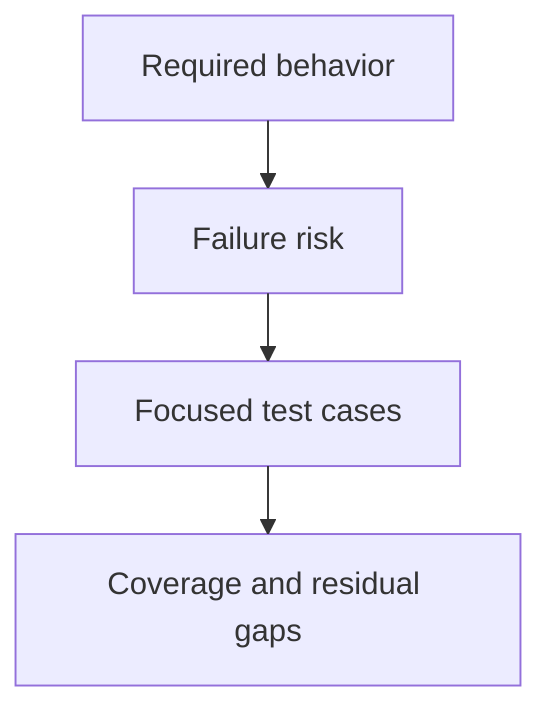

## Purpose

Add or update focused coverage for a stated behavior.

## Approach

Map each test to an acceptance condition or risk, choose the smallest relevant test level, and document residual gaps.

## How it should be done

Name the behavior and failure risk; choose unit, integration, fixture, or live coverage; write deterministic success and boundary cases; avoid testing implementation details without contract value; record uncovered conditions and why.

## Design view

