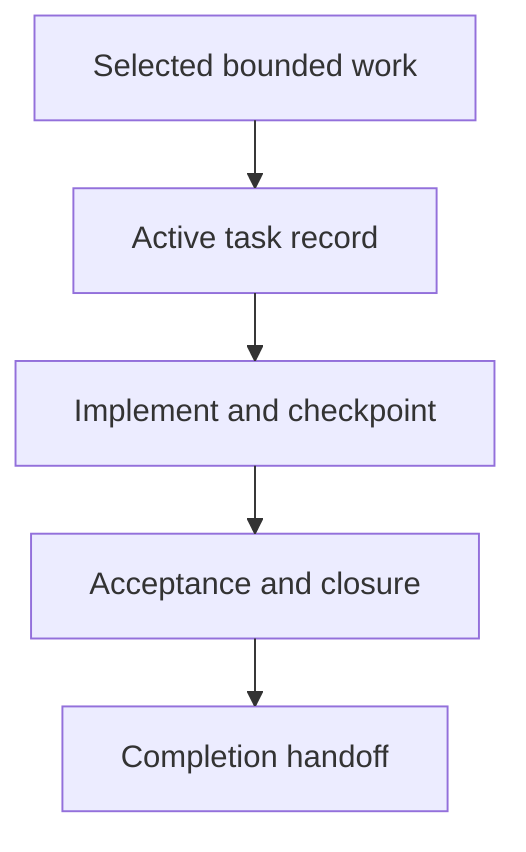

## Purpose

**Purpose**: Run the existing task lifecycle for authorized bounded requirements.

## Approach

**Approach**: Follow task applicability, start, execution, recovery, validation, descendant closure, changelog, backlog, and completion procedures without changing their authority.

## How it should be done

**How it should be done**: Verify an active authorized task before editing; record scope, acceptance, worker, budget, dependencies, checkpoints, and changed artifacts; update progress and recovery evidence; require acceptance and terminal descendants; hand completion to history, cleanup, and commit procedures.

## Design view

## Composition context

Component-variant table row (drafts/composable-skills.md lines 98-100; this master's position in the component-based order):

| Composition | Preferred reusable skills | Required distinction |
| --- | --- | --- |
| Component-based change | `resolving-scopes` → `identifying-owners` → `building-context` → `choosing-change-methods` → `implementing-tasks` → `writing-code` or `applying-bounded-edits` → `writing-tests` → `validating-changes` → `locating-changelogs` → `managing-changelogs` | Preserve the component task protocol, descendant closure, owning changelog, backlog reconciliation, task cleanup, and scoped completion handoff. |

Tool-access composition admission (drafts/composable-skills.md lines 112-113): A skill does not grant tools. Before an agent is admitted to a master skill or composition, the composition's required tool set must be compared with the agent's declared tools, permissions, and authority. The agent must have every tool needed for its selected path, or the workflow must stop with a bounded missing-capability blocker; it must not silently substitute a weaker tool, broaden permissions, or ask a read-only agent to perform mutation.