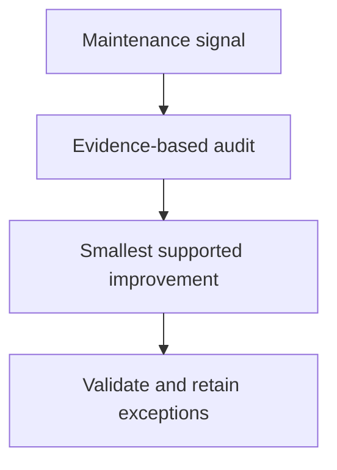

## Purpose

**Purpose**: Inspect and apply the smallest evidence-supported component improvements.

## Approach

**Approach**: Audit a bounded component against applicable records and conventions, fix confirmed issues only, validate the change, and preserve ownership and recovery boundaries.

## How it should be done

**How it should be done**: Define the component and maintenance signal; inspect records, consumers, and conventions; distinguish confirmed defect from preference; propose or apply the smallest authorized fix; validate structure and behavior; record retained exceptions and residual risk.

## Design view

## Composition context

No composition table, workflow example, or tool-access row is cited for this master by the realization plan (plan section 7 composition-context column: "—"). Carry the general tool-access acknowledgment as composition-admission documentation (drafts/composable-skills.md lines 112-113): A skill does not grant tools. Before an agent is admitted to a master skill or composition, the composition's required tool set must be compared with the agent's declared tools, permissions, and authority. The agent must have every tool needed for its selected path, or the workflow must stop with a bounded missing-capability blocker; it must not silently substitute a weaker tool, broaden permissions, or ask a read-only agent to perform mutation.