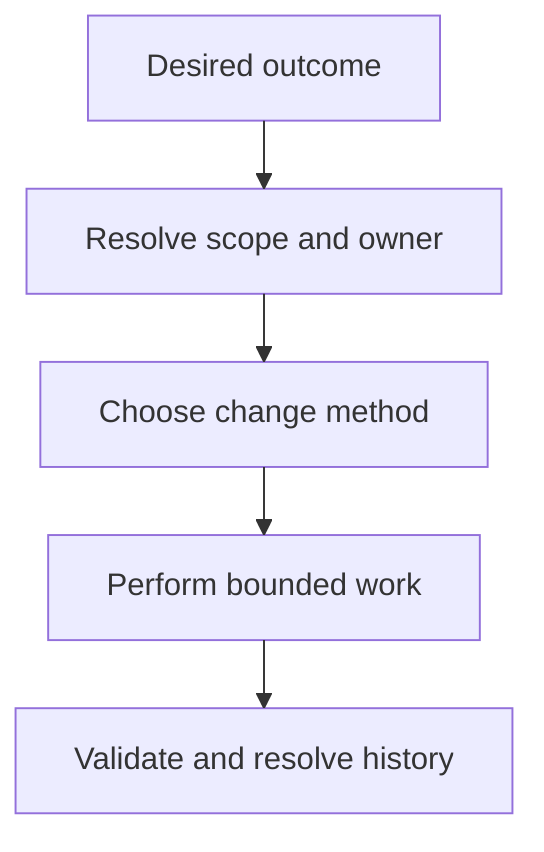

## Purpose

**Purpose**: Make and validate general changes with the smallest applicable scopes and history treatments.

## Approach

**Approach**: Resolve scope and ownership, choose the change method, compose the needed reusable skills, validate the result, and resolve durable history when required.

## How it should be done

**How it should be done**: Select this master from the requested outcome; resolve component versus non-component scope first; choose the matching composition variant; verify tools and permissions; compose only applicable skills; enforce validation and history gates; stop on unresolved ownership or task applicability.

## Design view



## Composition context

Composition variant table (drafts/composable-skills.md lines 98-104):

| Composition | Preferred reusable skills | Required distinction |
| --- | --- | --- |
| Component-based change | `resolving-scopes` → `identifying-owners` → `building-context` → `choosing-change-methods` → `implementing-tasks` → `writing-code` or `applying-bounded-edits` → `writing-tests` → `validating-changes` → `locating-changelogs` → `managing-changelogs` | Preserve the component task protocol, descendant closure, owning changelog, backlog reconciliation, task cleanup, and scoped completion handoff. |
| Non-component change | `resolving-scopes` → `identifying-owners` → `building-context` → `choosing-change-methods` → `writing-code` or `applying-bounded-edits` → `writing-tests` when useful → `validating-changes` → `locating-changelogs` → `managing-changelogs` when required | Do not create a component task merely because a reusable skill or nearby component exists; resolve the applicable artifact, project, or root authority and history contract. |

The arrows show a master-selected preference order, not mandatory activation of every skill. A master may omit a skill when its contract does not apply, but it must state why, preserve required gates, and stop when the applicable owner or contract is unresolved. Reusable skills remain directly usable for focused requests, but agents should prefer the selected master composition for an outcome-sized workflow.

Workflow example (drafts/composable-skills.md lines 164-166):

```text
making-changes = resolving-scopes → building-context → choosing-change-methods → writing-code or applying-bounded-edits → validating-changes → managing-changelogs when required
```

Tool-access composition admission (drafts/composable-skills.md lines 126-128):

For the two `making-changes` variants, the component-based path would normally require context inspection, linked-context resolution, bounded mutation, relevant checks, durable-record access, and—when completion is authorized—delegation and scoped Git handoff capabilities. The non-component path would require only the tools needed for its resolved artifact, project, or root scope and applicable history contract; it must not inherit component-task or commit tools merely because they exist in another composition. Advisory, evidence-validator, and router agents should receive read-only or routing tools only and must not be admitted to mutation-capable compositions.
