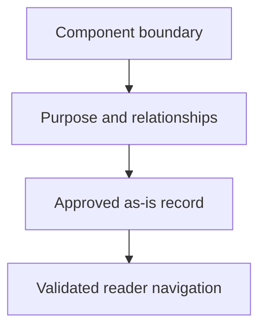

## Purpose

**Purpose**: Create, align, and navigate durable component records.

## Approach

**Approach**: Resolve component context, apply the record contract, update relationships and navigation, validate content and diagrams, and preserve canonical ownership.

## How it should be done

**How it should be done**: Identify the component boundary and parent; read the record contract; create or revise Purpose, Components, Design, Relationships, and navigation; keep task state out; validate links, diagrams, and child parity; stop when ownership is unclear.

## Design view

## Composition context

No composition table, workflow example, or tool-access row is cited for this master by the realization plan (plan section 7 composition-context column: "—"). Carry the general tool-access acknowledgment as composition-admission documentation (drafts/composable-skills.md lines 112-113): A skill does not grant tools. Before an agent is admitted to a master skill or composition, the composition's required tool set must be compared with the agent's declared tools, permissions, and authority. The agent must have every tool needed for its selected path, or the workflow must stop with a bounded missing-capability blocker; it must not silently substitute a weaker tool, broaden permissions, or ask a read-only agent to perform mutation.