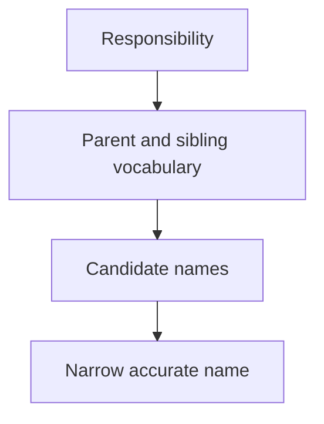

## Purpose

Select semantically accurate names using local conventions.

## Approach

Inspect the concept's parent, siblings, and naming guidance, then choose the narrowest accurate name and record material departures.

## How it should be done

Identify the concept's responsibility and lifecycle; inspect parent and sibling names; consult naming guidance; compare alternatives for semantic precision and discoverability; choose one name; update proven references atomically when renaming.

## Design view

