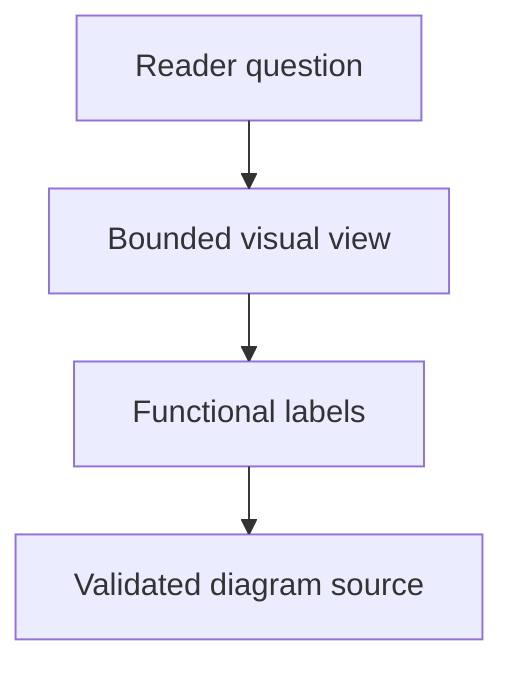

## Purpose

Design bounded reader-oriented visual explanations.

## Approach

Select a diagram type and symbols that explain the intended relationships while keeping source, navigation, and ownership accurate.

## How it should be done

Define the reader question and view boundary; choose functional nodes and canonical relationships; include only supported context; design labels and layout for scanning; provide source and expected navigation targets for validation.

## Design view

## Rendering validation

Subsumes the `rendering-diagrams` contract (folded per user adjudication 2026-08-30, flag 6.4: rendering is a validation concern of diagram creation, not a standalone capability).

**Purpose**: Render and inspect diagrams when rendering is material.

**Approach**: Use the available renderer, inspect the output and expected links, and report unsupported renderer capability separately from source validity.

**How it should be done**: Validate source syntax first; render through the approved local capability; inspect geometry, labels, links, and expected hrefs; distinguish renderer-unavailable from source-invalid; retain source-level evidence when rendering cannot run.
