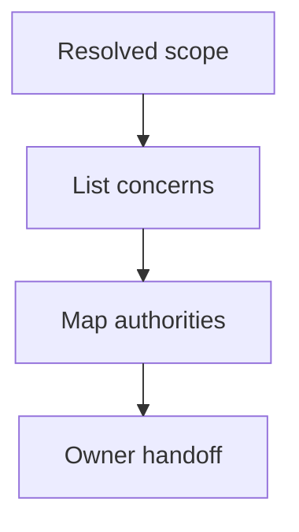

## Purpose

Identify the authorities and owners for the resolved scopes.

## Approach

Trace each concern to its canonical owner and separate authority, consultation, and implementation responsibilities.

## How it should be done

Build a concern-to-owner table for implementation, task state, durable records, history, validation, delegation, and commits; verify each owner from a record or contract; distinguish who may advise, edit, authorize, and integrate.

## Design view

