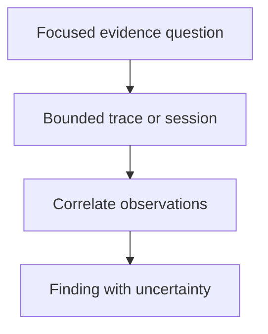

## Purpose

Investigate bounded traces, sessions, or execution results.

## Approach

Read only the authorized evidence surface, correlate bounded events, and distinguish observations from inferred causes or authority.

## How it should be done

Require an exact selector and focused question; read the smallest bounded trace or session slice; correlate event names and timing; report observed facts, hypotheses, unknowns, and freshness; never use evidence to authorize work or completion.

## Design view

